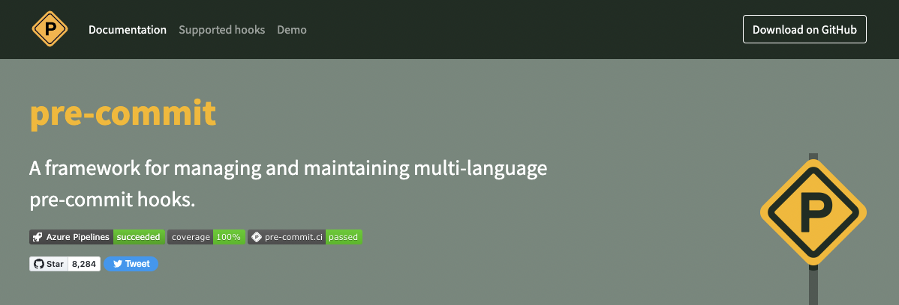
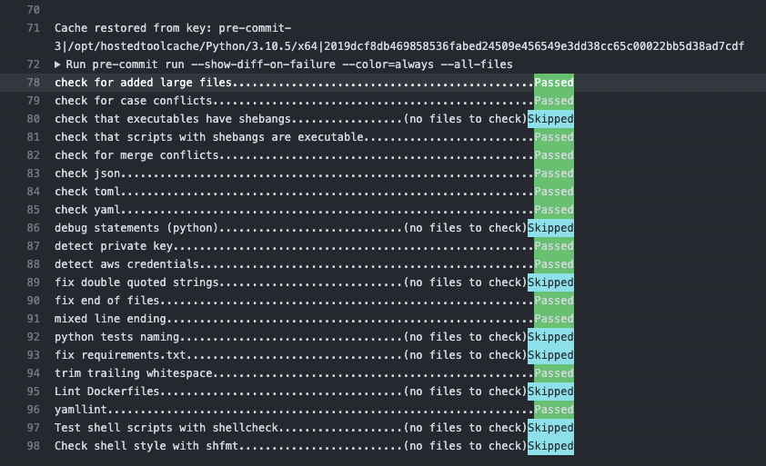
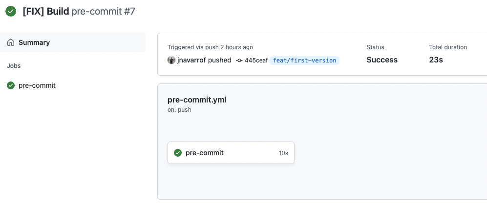
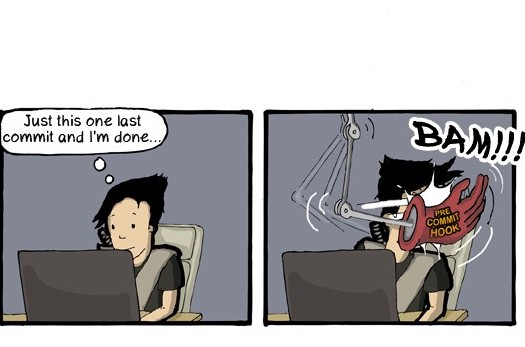

<!--
_footer: "[https://github.com/jnavarrof/sa-pre-commit-slides](https://github.com/jnavarrof/sa-pre-commit-slides)
"
-->


# <!--fit--> **Introduction to *pre-commit***
<!--  -->

## A framework for managing multi-language pre-commit hooks

<!-- ---
# The Challenge
When developing collaboratively, we typically use git for version control and commit any changes to a feature branch that is reviewed before merging into the main codebase.

The **problem is nothing stops us from committing *low-quality* code** to the repository.

Low-quality code could include:

- code that is non compliant
- contains unused imports
- references to variables before assignment
- code that is failing on basic validation and liting steps
 -->

---


## Link: [pre-commit hooks](https://pre-commit.com/)

---
# <!--fit--> Why `pre-commit hooks`?

- Validation and linting are Best Practices
- Helps running linting and validation tests
- The number of [available checks](https://pre-commit.com/hooks.html) is extensive
- Easy step towards *shifting left* with security
- Simple integration with CI/CD pipelines

---
# Development workflow example using `pre-commit`

Image below shows an example development workflow. Pre-commit hooks are triggered to run the black code formatter, flake8 checker over files with changes. If all checks are succesfull, commit operation will continue.
<br/>


Source: [Automate Python workflow using pre-commits: black and flake8](https://ljvmiranda921.github.io/notebook/2018/06/21/precommits-using-black-and-flake8/).

---
# Prepare your environment
Install `pre-commit` tool

```bash
$ pip install pre-commit
```

Add an initial `.pre-commit-config.yaml` file in your repository.

```bash
$ pre-commit sample-config > .pre-commit-config.yaml
```

---
# Basic `.pre-commit-config.yaml` file
File should look something like this:

```yaml
# See https://pre-commit.com for more information
# See https://pre-commit.com/hooks.html for more hooks
repos:
-   repo: https://github.com/pre-commit/pre-commit-hooks
    rev: v3.2.0
    hooks:
    -   id: trailing-whitespace
    -   id: end-of-file-fixer
    -   id: check-yaml
    -   id: check-added-large-files
```

---
# Install & Run locallly
Install all (and optionally update) all *git hooks*

```bash
$ pre-commit autoupdate
$ pre-commit install --install-hooks
```

and run over all files

```bash
$ pre-commit run --all-files
```

---
# Example: Dockerfiles

```bash
$ make patch_docker
* Patch for Docker
pipenv run patch --verbose .pre-commit-config.yaml docker.patch
done

$ make validate
* Pre-commit run
pipenv run pre-commit run --all-files
check for added large files..............................................Passed
check for case conflicts.................................................Passed
check that executables have shebangs.................(no files to check)Skipped
check that scripts with shebangs are executable..........................Passed
check for merge conflicts................................................Passed
check json...............................................................Passed
check toml...............................................................Passed
check yaml...............................................................Passed
debug statements (python)............................(no files to check)Skipped
detect private key.......................................................Passed
detect aws credentials...................................................Passed
fix double quoted strings............................(no files to check)Skipped
fix end of files.........................................................Passed
mixed line ending........................................................Passed
python tests naming..................................(no files to check)Skipped
fix requirements.txt.................................(no files to check)Skipped
trim trailing whitespace.................................................Passed
Lint Dockerfiles.........................................................Failed
- hook id: hadolint
- exit code: 1

examples/Dockerfile:2 DL3018 warning: Pin versions in apk add. Instead of `apk add <package>` use `apk add <package>=<version>`
examples/Dockerfile:2 DL3019 info: Use the `--no-cache` switch to avoid the need to use `--update` and remove `/var/cache/apk/*` when done installing packages
examples/Dockerfile:4 DL3002 warning: Last USER should not be root

yamllint.................................................................Passed
Test shell scripts with shellcheck...................(no files to check)Skipped
make: *** [validate] Error 1
```
---


##### <!--fit--> [GitHub Actions](https://github.com/actions) + [`pre-commit` hooks](https://pre-commit.com/)
##### <!--fit--> 👉 The easiest way to keep  your repository tidy


---
# Create a GitHub Action
To use with GitHub Actions, make a file `.github/workflwos/pre-commit.yml`. Use following template to get started.

```yaml
---
name: pre-commit
on:
  push:

jobs:
  pre-commit:
    runs-on: ubuntu-latest
    steps:
      - uses: actions/checkout@v3
      - uses: actions/setup-python@v3
      - uses: pre-commit/action@v3.0.0
```

---

# [GitHub Action](https://github.com/jnavarrof/sa-pre-commit-slides/actions/workflows/pre-commit.yml) <br/> running on GH




---

<!-- Scoped style -->
<style scoped>
img[alt~="center"] {
  display: block;
  margin: 0 auto;
}
</style>



# <!--fit--> Get Started!
## <!--fit-->  **[pre-commit hooks you must know](https://towardsdatascience.com/pre-commit-hooks-you-must-know-ff247f5feb7e)**
[](https://towardsdatascience.com/pre-commit-hooks-you-must-know-ff247f5feb7e)

# <!--fit--> boost your productivity

---

<style scoped>
h3 {
  text-align: center;
  display: block;
  margin: 0 auto;
}
</style>

### <!--fit--> :ok_hand:

---

This is an empty slide.

---
<!-- Scoped style -->
<style scoped>
img[alt~="center"] {
  display: block;
  margin: 0 auto;
}
</style>


# <!--fit--> Get Started!

## <!--fit-->  **[pre-commit hooks you must know](https://towardsdatascience.com/pre-commit-hooks-you-must-know-ff247f5feb7e)**

[](https://towardsdatascience.com/pre-commit-hooks-you-must-know-ff247f5feb7e)

# <!--fit--> boost your productivity
