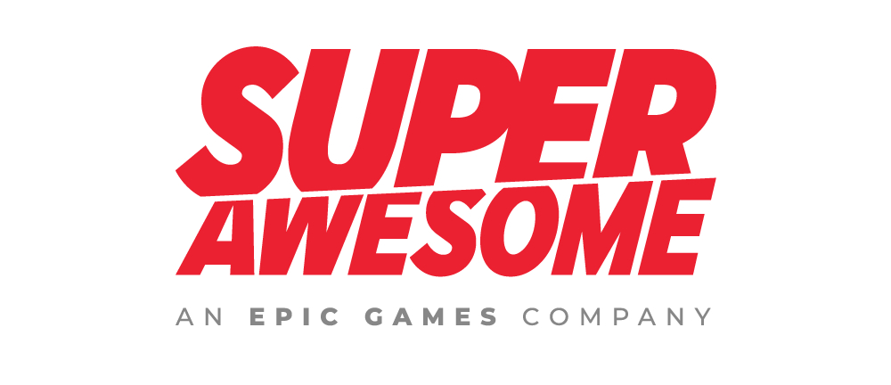

# <!--fit--> An introduction to *pre-commit*
The easiest way to keep your repository tidy

---

## asdfdsf

asdfasdf
asdfasdf

---

---

##### <!--fit--> [Marp CLI](https://github.com/marp-team/marp-cli) + [GitHub Pages](https://github.com/pages) | [Netlify](https://www.netlify.com/) | [Vercel](https://vercel.com/)

##### <!--fit--> 👉 The easiest way to host your Marp deck on the web

---

## **[GitHub Pages](https://github.com/pages)**

#### Ready to write & host your deck!

---

## **[Netlify](https://www.netlify.com/)**

#### Ready to write & host your deck!

---

## **[Vercel](https://vercel.com/)**

#### Ready to write & host your deck!

---
<!--
paginate: false
footer: ''
-->

### <!--fit--> :ok_hand:

