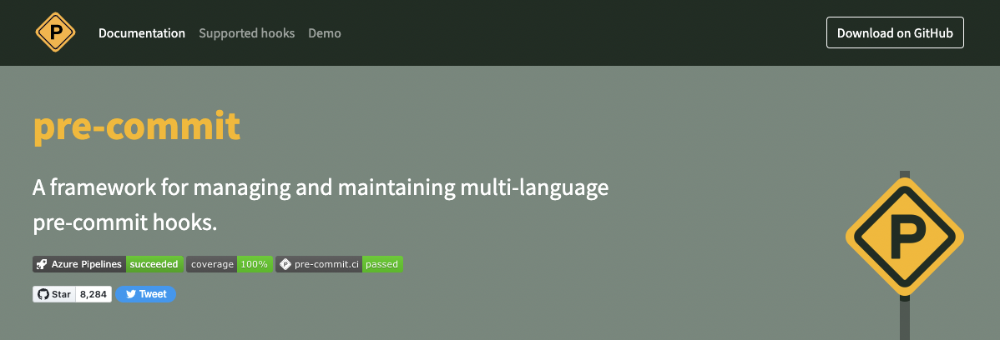

# <!--fit--> An introduction to *pre-commit*
The easiest way to keep your repository tidy
<!--  -->

---

<!-- _theme: default -->

Link: [pre-commit hooks](https://pre-commit.com/)

---
#### <!--fit--> Using `git pre-commit hooks`

* Validation and linting are Best Practices
* The number of available checks is extensive
* Easy step towards *shifting left* with security
* Simple integration with CI/CD pipelines

---

##### <!--fit--> [GitHub Actions](https://github.com/actions) + [pre-commit hooks](https://pre-commit.com/)
##### <!--fit--> 👉 The easiest way to keep   your repository tidy

---
<!-- footer: '' -->

###### <!--fit-->  **[pre-commit hooks you must know](https://towardsdatascience.com/pre-commit-hooks-you-must-know-ff247f5feb7e)**

### Boost your productivity!

---
<!--
paginate: false
footer: ''
-->

### <!--fit--> :ok_hand:
